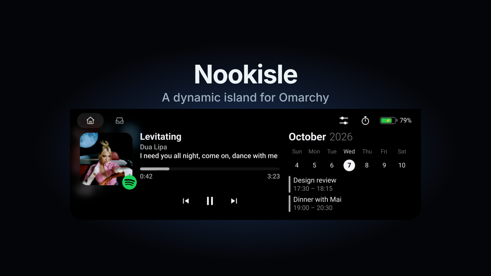

# Nookisle

Nookisle is a native music controller for Omarchy, modelled on [boring.notch](https://github.com/TheBoredTeam/boring.notch). On a top bar it becomes a black notch over the bar's centre: music with a lyric line, a file shelf, calendar, camera mirror and HUD.

*Note: Nookisle is a Linux desktop component for Omarchy and is entirely unrelated to macOS notch applications.*



## Install

Install directly through Omarchy's plugin manager:

```sh
omarchy plugin add https://github.com/bavanchun/nookisle --enable
```

### Requirements
- Omarchy 4.x with a top bar
- x86_64 architecture
- Qt ≥ 6.8

### Runtime Packages
Runtime package dependencies (provided by standard Omarchy installations, named here in prose):
`qt6-base`, `qt6-multimedia`, `libpipewire`, `systemd-libs`, `openssl`, `libglvnd`, and `python`.

### Optional Packages
- `libsecret`: required for CalDAV calendar password storage via Secret Service.
- `zip` and `imagemagick`: required for shelf archive and image conversion actions.

## Usage

- **Hover and click:** Hover the notch to open the Home panel; move the pointer away to collapse. Click or tap to expand immediately.
- **Summon key:** Press the configured summon shortcut (such as SUPER+M) to open the island with full keyboard focus; Escape collapses it.
- **Header tabs:** Switch between the **Home** player and the **Shelf** file tray.
- **Welcome flow:** On the first run, an onboarding window opens to introduce the idle look, online covers, remembered player, synced lyrics, calendar, and camera mirror. Nothing changes until you choose.

## Configure

Open settings at any time by clicking the gear icon in the open island's header, or run `omarchy-shell nookisle settings`.
Settings are saved to `~/.config/nookisle/settings.json` (mode 0600).

Nothing is edited automatically. Optional manual steps, each with its exact configuration change and how to undo it:

### 1. Bar Centring
To center the island on a full-width top bar, move the widget to the center section:
```sh
omarchy bar move io.github.bavanchun.nookisle --section center --index 0
```
Then set `"centerAnchor": "io.github.bavanchun.nookisle"` in `~/.config/omarchy/shell.json` under `"bar"`, and reload the shell.
- **To undo:** Move the widget to another section or remove `"centerAnchor"` from `shell.json`.

### 2. Summon Key Binding
To summon Nookisle with a global shortcut, add this line to `~/.config/hypr/bindings.lua`:
```lua
o.bind("SUPER + M", "Nookisle", [[omarchy-shell shell summon io.github.bavanchun.nookisle '{"autoClose":true}']])
```
- **To undo:** Delete the line from `~/.config/hypr/bindings.lua`.

### 3. Level Readout (HUD)
Enable the island's on-screen volume and brightness readout:
```sh
omarchy-shell nookisle configure '{"hud":true}'
```
Enabling the HUD may produce duplicate on-screen displays alongside Omarchy's default OSD unless media keys are rebound (see [docs/install.md](docs/install.md#one-on-screen-display-for-media-keys)).
- **To undo:** Run `omarchy-shell nookisle configure '{"hud":false}'`.

### 4. Chrome Extension & Native Host
For exact-document tab control in Google Chrome or Chromium, register the native messaging host:
See the [bridge documentation on main](https://github.com/bavanchun/nookisle/blob/main/bridge/README.md).
- **To undo:** Remove the extension in the browser and delete the native messaging host manifest from `~/.config/google-chrome/NativeMessagingHosts/io.github.bavanchun.nookisle.json`.

## Remove

To remove the plugin:

```sh
omarchy plugin remove io.github.bavanchun.nookisle
```

Then undo anything you set up by hand:
1. Remove the summon key binding from `~/.config/hypr/bindings.lua`.
2. Reset `bar.centerAnchor` in `~/.config/omarchy/shell.json`.
3. If configured, remove the Chrome extension and delete the native messaging manifest:
   - `rm -f ~/.config/google-chrome/NativeMessagingHosts/io.github.bavanchun.nookisle.json`
   - (or `~/.config/chromium/NativeMessagingHosts/io.github.bavanchun.nookisle.json` for Chromium)
4. Delete Nookisle configuration, state, and credentials:
   - `rm -rf ~/.config/nookisle`
   - `rm -rf ~/.local/state/nookisle`
   - `secret-tool clear service nookisle`

## Privacy and permissions

Nookisle is a local controller. No audio, credentials, browsing history, or telemetry leave the machine.

### Helper Processes
- `nookisle-helper`: coordinates local D-Bus session communication, MPRIS endpoints, backlight monitoring, and calendar sync.
- `nookisle-spectrum`: reads audio output monitor levels via PipeWire to compute 12-band frequency amplitudes; audio samples never leave the process.
- `nookisle-artwork-fetch`: short-lived child process that fetches opt-in remote album artwork over HTTPS with strict address validation.
- `nookisle-artwork-decoder`: isolated child process without network or D-Bus access that sanitizes and re-encodes images to 256 px.
- `nookisle-media-keys`: handles volume and brightness hotkeys to route readouts between the island and desktop OSD.
- `nookisle-native-host`: communicates via standard input/output with the optional Chrome extension over a private local UNIX socket.

### System Access
- **State read:** MPRIS media properties, Hyprland IPC window and workspace events, UPower battery status, PipeWire audio spectrum, `/proc/<pid>/fd` links of the user's own processes (to show camera activity dots while excluding system daemons), and Omarchy's recording marker in `/tmp`.
- **System services:** `systemctl --user stop` is used only for the user's own reminder timers.
- **Privacy gates:** The camera mirror activates only upon explicit user opening. CalDAV accounts connect only when configured. Online album artwork and synced lyrics (from LRCLIB) are strictly opt-in and disabled by default.
- **Boundaries:** No elevated privileges, no system-level services, and no remote builds.

## Updating

Update the plugin to the latest version:

```sh
omarchy plugin update io.github.bavanchun.nookisle
omarchy-restart-shell
```

Restarting the shell (`omarchy-restart-shell`) is necessary because `keepLoaded` keeps the previous plugin and helper service loaded until restart.

Updates contain pre-compiled binaries. You can verify the integrity of the plugin files before restarting:

```sh
omarchy plugin validate ~/.config/omarchy/plugins/io.github.bavanchun.nookisle
```

## Build provenance

Release builds and distribution packages are generated automatically by GitHub Actions:
- **Signer workflow:** [release.yml](https://github.com/bavanchun/nookisle/actions/workflows/release.yml)
- **Attestation verification:** Verify any downloaded release artifact or binary with the GitHub CLI:
  ```sh
  gh attestation verify <file> --repo bavanchun/nookisle --signer-workflow bavanchun/nookisle/.github/workflows/release.yml --source-ref refs/tags/v1.0.2 --deny-self-hosted-runners
  ```
- **SHA256SUMS header:** Shipped packages contain a signed `SHA256SUMS` file with the header `# nookisle <tag> <source sha>` that binds the release tag to the exact commit SHA on `main`.
- **Reproducible rebuild:** The release can be rebuilt in the pinned container using [scripts/rebuild-dist.sh on main](https://github.com/bavanchun/nookisle/blob/main/scripts/rebuild-dist.sh).

## Development

For building from source, running tests, and developing Nookisle, see the [Development Guide on main](https://github.com/bavanchun/nookisle/blob/main/docs/development.md).

## License

MIT License. See [LICENSE](LICENSE).

Crediting [boring.notch](https://github.com/TheBoredTeam/boring.notch) as the design inspiration for the notch presentation (no code copied).
